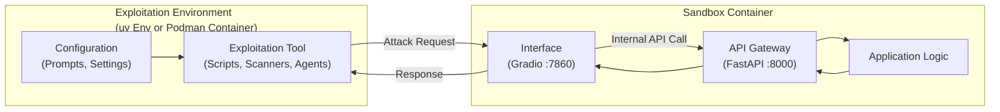

# GenAI Red Team Lab

The [GenAI Red Team Lab](https://github.com/GenAI-Security-Project/GenAI-Red-Team-Lab/) is part of the [OWASP GenAI Security Project](https://github.com/GenAI-Security-Project). It is a branch of the [OWASP GenAI Security Project – Red Teaming Initiative](https://genai.owasp.org/initiatives/#ai-redteaming) and it stands on its own, but it also serves as a companion for the initiative documents, such as the [GenAI Red Teaming Manual](https://genai.owasp.org/initiatives/#ai-redteaming).

This repository provides a collection of sandboxes, exploitation code, and tutorials that exemplifies GenAI Red Teaming exercises. It aims to help security researchers and developers test, probe, and evaluate the safety and security of GenAI-based applications.

This is how we envision the [GenAI Red Team Lab](https://github.com/GenAI-Security-Project/GenAI-Red-Team-Lab/) being used:

* **Sandboxes** may be simply recycled to model the core components of a larger GenAI system.

    Alternatively, security researchers and developers may want to adapt a sandbox for their own use case.

* **Exploitation code and tutorials** may serve as learning tools for security researchers and enthusiasts alike.

    Additionally, these are easily adaptable for testing out new attacks against sandboxes.

## Contact

- **Code Workstream Leader for the [OWASP GenAI Security Project – Red Teaming Initiative](https://genai.owasp.org/initiatives/#ai-redteaming)**:

    _Felipe Campos Penha ([felipe.penha@owasp.org](mailto:felipe.penha@owasp.org))_

## Legacy Repository

The [Legacy Repository](https://github.com/OWASP/www-project-top-10-for-large-language-model-applications/tree/main/initiatives/genai_red_team_handbook) has the history of original contributions by authors _Felipe Campos Penha_ and _Jason Ross_.


## Directory Structure

```text
.
├── CONTRIBUTING.md
├── exploitation
│   ├── AdversarialGenerator
│   ├── agent0
│   ├── embedding_inversion
│   ├── example
│   ├── garak
│   ├── haystack
│   ├── langchain
│   ├── Langflow_v1.0.12
│   ├── LangGrinch
│   ├── llamaindex
│   ├── LocalAI_v2.17.1
│   ├── memory_poisoning
│   ├── n8n_RCE_via_file_write
│   ├── Ni8mare
│   ├── promptfoo
│   ├── semantickernel
│   └── system_reconnaissance
├── LICENSE
├── README.md
├── sandboxes
│   ├── agentic_local_haystack
│   ├── agentic_local_langchain
│   ├── agentic_local_llamaindex
│   ├── agentic_local_n8n_v1.65.0
│   ├── agentic_local_semantickernel
│   ├── llm_local
│   ├── llm_remote
│   ├── llm_local_InvokeAI_v5.3.0
│   ├── llm_local_langchain_core_v1.2.4
│   ├── llm_local_langflow_v1.0.12
│   ├── llm_local_localAI_v2.17.1
│   ├── llm_memory_local
│   ├── mcp_local
│   ├── RAG_local
│   └── README.md
└── tutorials
    ├── community_resources.md
    ├── evaluation_framework_passk
    ├── fake_testing_mode_prompt_injection_tutorial.md
    ├── langchain_orchestration_poisoning_tutorial.md
    ├── llamaindex_orchestration_security_tutorial.md
    ├── llm_chatbot_system_prompt_exfiltration.md
    ├── multi_technique_guardrail_bypass_evaluation.md
    ├── multi_turn_safety_bypass_and_system_role_override.md
    ├── README.md
    ├── semantickernel_orchestration_security_tutorial.md
    └── tools.md
```

## Architecture



## System Requirements

This project supports **Linux** and **macOS**. Windows users are encouraged to use WSL2 (Windows Subsystem for Linux).

### Required Tools

*   **[Podman](https://podman.io/)**
*   **[Ollama](https://ollama.com/)**
*   **[Python 3.10+](https://www.python.org/)**
*   **[uv](https://github.com/astral-sh/uv)**
*   **[Make](https://www.gnu.org/software/make/)**

Required for Promptfoo exploitation-only:

*   **[Node.js (v18+)](https://nodejs.org/)**
*   **[npx](https://docs.npmjs.com/cli/v10/commands/npx)**

### Installation Instructions

#### macOS

1.  **Install Dependencies**:
    ```bash
    brew install podman ollama node make
    ```

2.  **Initialize Podman Machine**:
    ```bash
    podman machine init
    podman machine start
    ```

#### Linux (Ubuntu/Debian)

1.  **Install Dependencies**:
    ```bash
    sudo apt-get update
    sudo apt-get install -y podman nodejs npm make
    ```

2.  **Install Ollama**:
    ```bash
    curl -fsSL https://ollama.com/install.sh | sh
    ```

3.  **Install uv**:
    ```bash
    pip install uv
    ```

### Verification

Verify the installation by checking the versions of the installed tools:

```bash
podman version
ollama --version
node --version
make --version
uv --version
```

## Index of Sub-Projects

### `sandboxes/`

*   **[Sandboxes Overview](sandboxes/README.md)**
    *   The central hub for all available sandboxes. It explains the purpose of these isolated environments and lists the available options.

*   **[RAG Local Sandbox](sandboxes/RAG_local/README.md)**
    *   A comprehensive RAG sandbox that includes a mock Vector Database (Pinecone compatible), mock Object Storage (S3 compatible), and a mock LLM API (OpenAI compatible). Specifically designed for red teaming RAG architectures, allowing researchers to explore vulnerabilities such as embedding inversion, data poisoning, and retrieval manipulation in a controlled setting.
    *   **Sub-guides**:
        *   [Adding New Mock Services](sandboxes/RAG_local/app/mocks/README.md): Guide for extending the sandbox with new API mocks.

*   **[LLM Local Sandbox](sandboxes/llm_local/README.md)**
    *   A local sandbox environment that mocks an LLM API (compatible with OpenAI's interface) using a local model (via Ollama). Useful for testing client-side interactions, prompt injection, and security assessments without external paid APIs. Allows developers to customize the underlying LLM and orchestrate GenAI pipelines incorporating RAG and guardrails.
    *   **Sub-guides**:
        *   [Adding New Mock Services](sandboxes/llm_local/app/mocks/README.md): Guide for extending the sandbox with new API mocks.

*   **[LLM Remote Sandbox](sandboxes/llm_remote/README.md)**
    *   A remote sandbox exposing an OpenAI-compatible API gateway interfacing with cloud LLM providers (OpenAI, Anthropic, Gemini, Mistral, OpenRouter, TrueFoundry) using native SDKs. Designed for Red Teaming remote APIs, evaluating safety guardrails, testing prompt injection, and assessing model behaviors in production-like environments with vendor auto-detection and key pinning.

*   **[Local MCP Sandbox](sandboxes/mcp_local/README.md)**
    *   A local sandbox environment incorporating the Model Context Protocol (MCP) to simulate tool integrations. It includes a mock API gateway using FastAPI, a mock MCP server, and Ollama integration to test agentic workflows and tool-calling behaviors.

*   **[LangChain Local Sandbox (Vulnerable)](sandboxes/llm_local_langchain_core_v1.2.4/README.md)**
    *   A specialized local sandbox targeting LangGrinch (CVE-2025-68664), an insecure deserialization flaw in langchain-core v1.2.4. Mocks an OpenAI-compatible API backed by Ollama and includes a vulnerable client application demonstrating how prompt injection leads to credential exfiltration or Remote Code Execution (RCE) via unsafe object deserialization.

*   **[InvokeAI Sandbox (Vulnerable)](sandboxes/llm_local_InvokeAI_v5.3.0/README.md)**
    *   A sandbox environment deploying a vulnerable instance of **InvokeAI v5.3.0**. Designed to practice unauthenticated Remote Code Execution (RCE) via model deserialization attacks (CVE-2024-12029) against GenAI image generation platforms.

*   **[Langflow Sandbox (Vulnerable)](sandboxes/llm_local_langflow_v1.0.12/README.md)**
    *   A sandbox environment deploying a vulnerable instance of **Langflow v1.0.12** for testing unauthenticated Remote Code Execution (RCE) via its custom components backend (CVE-2024-37014).

*   **[LocalAI Sandbox (Vulnerable)](sandboxes/llm_local_localAI_v2.17.1/README.md)**
    *   A sandbox environment deploying a vulnerable instance of **LocalAI v2.17.1** for testing a critical tarslip vulnerability (CVE-2024-6868), which allows arbitrary file writes leading to Remote Code Execution (RCE).

*   **[n8n Vulnerable Sandbox](sandboxes/agentic_local_n8n_v1.65.0/README.md)**
    *   A vulnerable n8n sandbox (v1.65.0) configured to demonstrate critical vulnerabilities such as Ni8mare (CVE-2026-21858) and CVE-2026-21877 (RCE via File Write). Pre-configured with dangerous nodes enabled and network exposure to practice manual RCE and workflow manipulation in an agentic automation tool.

*   **[Semantic Kernel Vulnerable Sandbox](sandboxes/agentic_local_semantickernel/README.md)**
    *   A containerized sandbox running Microsoft Semantic Kernel v1.48.0 demonstrating 6 active CVE-2026-25592 path traversal bypass techniques via Type Confusion (CWE-843). Features dual-mode operation (UNHARDENED/HARDENED) and demonstrates Commit fa2d52f6 Shell Blinding bypass where cosmetic output masking fails to prevent file writes.

*   **[LangChain Orchestration Poisoning Sandbox](sandboxes/agentic_local_langchain/README.md)**
    *   A containerized sandbox running LangChain-core (v1.2.24 through latest) demonstrating critical Insecure Orchestration vulnerabilities across 5 lifecycle stages. Demonstrates CVE-2026-34070 (path traversal), unpatched CVE-2023-36258 (symlink suffix bypass), and unpatched .save() write primitives.

*   **[Haystack Serialization Evasion Sandbox](sandboxes/agentic_local_haystack/README.md)**
    *   A containerized sandbox running Deepset Haystack (haystack-ai v2.27.0) demonstrating a critical Serialization Boundary Evasion vulnerability. Deserialization in default_from_dict() bypasses the unsafe=False boundary, enabling persistent RCE via Jinja2 SSTI breakout in OutputAdapter and ConditionalRouter components.

*   **[LlamaIndex Orchestration Poisoning Sandbox](sandboxes/agentic_local_llamaindex/README.md)**
    *   A containerized sandbox running llama-index-core (v0.14.19 through v0.14.21+) demonstrating critical Insecure Orchestration vulnerabilities across 4 vendor response stages. Explores unpatched CWE-22 path traversal in SimpleKVStore.persist(), StorageContext.persist() vectors, and incomplete vendor remediation.

*   **[LLM Memory Local Sandbox](sandboxes/llm_memory_local/README.md)**
    *   A local sandbox environment for testing conversation memory poisoning vulnerabilities. It demonstrates how an attacker can instruct an LLM to persist unscoped facts in SQLite memory, which systematically influences future sessions initiated by other users.

### `exploitation/`

*   **[Red Team Example](exploitation/example/README.md)**
    *   Demonstrates a red team operation against a local LLM sandbox. Includes an adversarial attack script (attack.py) targeting the Gradio interface (port 7860). By targeting the application layer, this approach tests the entire system—including configurable system prompts—providing a realistic assessment of sandbox security compared to testing raw LLM APIs in isolation.

*   **[Agent0 Red Team Example](exploitation/agent0/README.md)**
    *   A complete, end-to-end, agentic example of a red-team operation against any local LLM sandbox. It orchestrates multiple autonomous agents (Agent0) to interact and attack the target application automatically, supporting both manual UI interaction and programmatic Makefile runs mapped to OWASP Top 10 and MITRE ATLAS.

*   **[Garak Scanner Example](exploitation/garak/README.md)**
    *   A comprehensive vulnerability scan using [Garak](https://github.com/NVIDIA/garak). It probes the sandbox for a wide range of weaknesses, including prompt injection, hallucination, and insecure output handling, mapping results to the OWASP Top 10.

*   **[Promptfoo Scanner Example](exploitation/promptfoo/README.md)**
    *   A powerful red teaming setup using [Promptfoo](https://www.promptfoo.dev/). It runs automated probes to identify vulnerabilities such as PII leakage and prompt injection, providing detailed reports and regression testing capabilities.

*   **[System Reconnaissance](exploitation/system_reconnaissance/README.md)**
    *   A repeatable bilingual (English and Turkish) reconnaissance campaign for existing local sandboxes. It probes nine disclosure surfaces, records conservative evidence labels, and produces machine-readable JSONL plus reviewer-friendly Markdown reports.

*   **[Embedding Inversion Attack](exploitation/embedding_inversion/README.md)**
    *   A complete, end-to-end example of an embedding inversion attack against the `RAG_local` sandbox. It reconstructs plaintext from a leaked, metadata-stripped embedding vector using only black-box access to the embedding model API and an LLM-guided guess-and-check loop.

*   **[Conversation Memory Poisoning Exploit](exploitation/memory_poisoning/README.md)**
    *   A complete, end-to-end example of a conversation memory poisoning attack against the `llm_memory_local` sandbox. It demonstrates how an attacker can plant malicious facts in shared memory to cross-contaminate and hijack future user sessions.

*   **[Langflow Exploitation](exploitation/Langflow_v1.0.12/README.md)**
    *   Details the discovery and exploitation of **CVE-2024-37014** (RCE via Custom Component) in the Langflow sandbox, demonstrating how an attacker can execute arbitrary system commands or establish a reverse shell.

*   **[LangGrinch Exploitation](exploitation/LangGrinch/README.md)**
    *   A dedicated exploitation module for **CVE-2025-68664** in the LangChain sandbox. It demonstrates how to use prompt injection to force the LLM into generating a malicious JSON payload, which is then insecurely deserialized by the application to leak environment secrets.

*   **[LocalAI Tarslip Exploitation](exploitation/LocalAI_v2.17.1/README.md)**
    *   Demonstrates how to exploit **CVE-2024-6868** (Tarslip) in the LocalAI sandbox. The exploit uses a custom Python script to upload a malicious tar file that writes files to arbitrary locations, leading to Remote Code Execution (RCE) by overwriting backend assets.

*   **[Ni8mare Exploitation](exploitation/Ni8mare/README.md)**
    *   A demonstration of **CVE-2026-21858** (Ni8mare) against the n8n sandbox. It uses a custom Python script to simulate the critical "Unauthenticated Arbitrary File Read" vulnerability, extracting the SQLite database and dumping administrator credentials (hashed passwords) to prove full system compromise.

*   **[n8n RCE via File Write Exploitation](exploitation/n8n_RCE_via_file_write/README.md)**
    *   A complete, end-to-end Python exploitation script for **CVE-2026-21877** targeting the vulnerable n8n sandbox. It demonstrates workflow injection to exploit the unrestricted `Execute Command` node.

*   **[Adversarial Prompt Generator](exploitation/AdversarialGenerator/README.md)**
    *   An automated system for generating diverse, category-specific jailbreak and prompt-injection payloads, and executing them against a local LLM sandbox. Uses `attack.py` to run attacks and generates detailed Markdown reports of the results.

*   **[Semantic Kernel CVE-2026-25592 Bypass Trainer](exploitation/semantickernel/README.md)**
    *   A master-class training lab demonstrating CVE-2026-25592 bypasses (Type Confusion / Late Canonicalization) and CWE-1039 (AutoInvoke Kernel Functions Abuse) with Shell Blinding (Commit fa2d52f6) evasion inside Microsoft Semantic Kernel. Features an automated testing harness and an interactive educational CLI.

*   **[LangChain Orchestration Poisoning Trainer](exploitation/langchain/README.md)**
    *   An interactive training wizard and verification suite demonstrating critical Insecure Orchestration vulnerabilities in LangChain-core across 5 lifecycle stages. Covers CVE-2026-34070 (direct path traversal), unpatched CVE-2023-36258 (symlink suffix bypass), and unpatched .save() write primitives. Includes an interactive CLI trainer and audit report.

*   **[Haystack Serialization Evasion Trainer](exploitation/haystack/README.md)**
    *   An interactive training wizard and automated verification suite demonstrating critical Serialization Boundary Evasion in Deepset Haystack (haystack-ai v2.27.0). Shows how default_from_dict() bypasses unsafe=False to achieve persistent framework compromise via __init__.py overwrite. Includes an interactive CLI trainer and exploit payloads.

*   **[LlamaIndex Orchestration Poisoning Trainer](exploitation/llamaindex/README.md)**
    *   An interactive training wizard and verification suite demonstrating critical Insecure Orchestration vulnerabilities in llama-index-core across 4 vendor response stages. Covers unpatched CWE-22 path traversal in SimpleKVStore.persist() and StorageContext.persist(), plus PyPI drift analysis. Includes an interactive CLI trainer and audit report.

*   **[Recommendation Memory Poisoning Exploit](exploitation/recommendation_poisoning/README.md)**
    *   A complete, end-to-end example of a recommendation system memory poisoning attack. Demonstrates how an attacker can manipulate conversational memory to bias subsequent recommendations across user sessions.


### `tutorials/`

*   **[Community Resources for Agentic AI Red Teaming](tutorials/community_resources.md)**
    *   A curated, professional list of community resources to help practitioners plan, execute, and improve agentic AI red teaming efforts.

*   **[Tools](tutorials/tools.md)**
    *   A curated list of tools, organized by the phases defined in the [GenAI Red Teaming Manual](https://genai.owasp.org/initiatives/#ai-redteaming).

*   **[LLM Chatbot System Prompt Exfiltration](tutorials/llm_chatbot_system_prompt_exfiltration.md)**
    *   A comprehensive tutorial outlining a five-stage attack chain (from passive reconnaissance to API-layer system role injection) targeting LLM-powered chatbots to exfiltrate their system prompt, including remediation steps.

*   **[Multi-Technique Guardrail Bypass Evaluation](tutorials/multi_technique_guardrail_bypass_evaluation.md)**
    *   Field observations documenting four guardrail-bypass technique families evaluated across a five-stage black-box sequence against a single chatbot deployment, with OWASP LLM01:2025 mapping and mitigation guidance.

*   **[Multi-Vector LLM Safety Bypass](tutorials/multi_turn_safety_bypass_and_system_role_override.md)**
    *   Field observations of a six-stage attack chain demonstrating four distinct classes of LLM safety bypass (such as control token injection and role-label spoofing) observed against production chatbot deployments during independent testing.

*   **[Fake Testing-Mode Prompt Injection](tutorials/fake_testing_mode_prompt_injection_tutorial.md)**
    *   An anonymized case study of a direct prompt-injection guardrail bypass using fabricated evaluation authority and user-defined controls, mapped to OWASP LLM01:2025 and MITRE ATLAS.

*   **[Pass@k Evaluation & Severity Scoring Layer](tutorials/evaluation_framework_passk/README.md)**
    *   A small, tool-agnostic evaluation and severity-scoring layer for red-team results. It computes per-trial attack success rates over k trials with Wilson confidence intervals, enforces the N-reroll rule, handles bounded null results, and maps findings to OWASP LLM and MITRE ATLAS.

*   **[LangChain Orchestration Poisoning Tutorial](tutorials/langchain_orchestration_poisoning_tutorial.md)**
    *   A deep-dive tutorial covering the exploitation and remediation of Insecure Orchestration vulnerabilities in LangChain-core (CVE-2026-34070 path traversal and CVE-2023-36258 symlink suffix bypass).

*   **[LlamaIndex Orchestration Security Tutorial](tutorials/llamaindex_orchestration_security_tutorial.md)**
    *   A comprehensive tutorial analyzing unpatched Insecure Orchestration vulnerabilities in llama-index-core, covering path traversal in SimpleKVStore.persist(), StorageContext.persist() exploitation, PyPI drift, and supply chain risks.

*   **[Semantic Kernel Orchestration Security Tutorial](tutorials/semantickernel_orchestration_security_tutorial.md)**
    *   A comprehensive tutorial analyzing the 6 Type Confusion bypass vectors for CVE-2026-25592 and AutoInvoke Shell Blinding (CWE-1039) in Microsoft Semantic Kernel.


*   **[Haystack Orchestration Security Tutorial](tutorials/haystack_orchestration_security_tutorial.md)**
    *   A comprehensive tutorial analyzing Serialization Boundary Evasion in Deepset Haystack (haystack-ai v2.27.0) and demonstrating persistent RCE via Jinja2 SSTI breakout.

## Contribution Guide

Please refer to [CONTRIBUTING.md](CONTRIBUTING.md) for instructions on how to add new sandboxes and exploitation examples.
