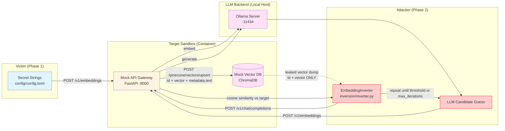

# Embedding Inversion: Reverse Engineering Embeddings

An end-to-end example of an **embedding inversion attack** against the
`RAG_local` sandbox: reconstructing the plaintext behind a leaked embedding
vector using only black-box access to the embedding model API.

This addresses backlog issue "Reverse Engineering Embeddings", mapped to
OWASP GenAI Red Teaming Manual `4.2.2.1 Embedding Inversion Attacks / A.
Reverse Engineering Embeddings`.

---

## Table of Contents

1. [Threat Model](#threat-model)
2. [Attack Strategy](#attack-strategy)
3. [Prerequisites](#prerequisites)
4. [Running the Attack](#running-the-attack)
5. [Configuration](#configuration)
6. [Files Overview](#files-overview)
7. [Known Limitations](#known-limitations)
8. [OWASP Top 10 for LLM Applications Coverage](#owasp-top-10-for-llm-applications-coverage)

---

## Threat Model

A RAG pipeline stores document chunks as embedding vectors in a vector
database (here, `RAG_local`'s mock Pinecone API backed by ChromaDB). If an
attacker obtains a **vector-only dump** of that store -- e.g. a
misconfigured backup, an insider export, or a leaked ChromaDB persistence
directory -- they get the raw floating-point vectors but not the plaintext
that produced them.

This script models exactly that split:

- **Phase 1 (victim)**: ingests secret strings the normal way -- embeds
  each one and upserts it to the vector store with the plaintext attached
  as metadata, mirroring `sandboxes/RAG_local/ETL/ingest.py`.
- **Phase 2 (attacker)**: is handed only `{id, vector}` pairs. It never
  reads the metadata produced in Phase 1. It does, however, still have
  black-box access to the same embedding model API (`POST /v1/embeddings`)
  that produced the vectors -- a realistic assumption when the embedding
  endpoint is exposed to more callers than the vector store itself.

The ground-truth plaintext is only reattached afterward, for scoring the
attack's own output -- never fed into the inversion loop itself.

## Attack Strategy



Each round: the LLM proposes a candidate phrase, the candidate is embedded
with the same model that produced the target vector, and cosine similarity
against the target is computed locally. The best-scoring candidate and its
score are fed back to the LLM to steer the next guess. This mirrors the
guess-and-check technique demonstrated in
[`ranfysvalle02/hacking-vectors`](https://github.com/ranfysvalle02/hacking-vectors),
adapted here into a self-contained victim/attacker split against
`RAG_local`.

---

## Prerequisites

- **Podman** (or Docker) -- container runtime for the sandbox.
- **Ollama**, with `gpt-oss:20b` and `nomic-embed-text` pulled
  (`sandboxes/RAG_local` provides `make ollama-pull`).
- **Make** -- for the convenience commands.
- **uv** -- for dependency management.

No changes to `sandboxes/RAG_local` are required; this attack only uses its
existing `/v1/embeddings`, `/v1/chat/completions`, and
`/pinecone/vectors/upsert` endpoints.

---

## Running the Attack

| Target | What it does | Typical usage |
|--------|---------------|----------------|
| `make setup` | Builds and starts the `RAG_local` mock API container. | `make setup` |
| `make attack` | Seeds the configured secrets, then runs the inversion attack. | `make attack` |
| `make test` | Runs the offline unit tests (no live sandbox needed). | `make test` |
| `make stop` | Stops and removes the sandbox container. | `make stop` |
| `make all` | Runs `stop → setup → attack → stop` in one shot. | `make all` |

`make test` exercises `inversion/inverter.py`'s control flow and the
cosine-similarity math against a scripted fake client, so the algorithm can
be validated without Podman, Ollama, or any live model.

---

## Configuration

### `config/config.toml`

```toml
[target]
sandbox = "RAG_local"

[attack]
secrets = [
    "The secret code is 12345.",
    "Reset password for admin: Tr0ub4dor&3",
]

embedding_model = "nomic-embed-text"
chat_model = "gpt-oss:20b"

max_iterations = 15
similarity_threshold = 0.93
```

- `secrets`: strings the victim phase ingests; each becomes one inversion
  target.
- `embedding_model` / `chat_model`: must match models available on the
  sandbox's Ollama backend (see `sandboxes/RAG_local/config/model.toml`).
- `max_iterations`: hard cap on guesses per target, to bound runtime and
  request load against the local model.
- `similarity_threshold`: cosine similarity at which a guess is treated as
  converged and the loop for that target stops early.

---

## Files Overview

- **`attack.py`**: Entry point -- loads config, runs the victim-ingestion
  phase, runs the attacker-inversion phase, writes `outputs/*.json` and
  `reports/*.md`.
- **`inversion/client.py`**: Thin `requests`-based client for the three
  `RAG_local` endpoints this attack touches.
- **`inversion/inverter.py`**: `EmbeddingInverter` (the guess-and-check
  loop) and `cosine_similarity`.
- **`tests/test_inverter.py`**: Offline `pytest` suite covering the
  inversion loop and similarity math via a fake client.
- **`config/config.toml`**: Target sandbox, secrets, models, loop bounds.

## Known Limitations

This module was validated in two stages, and it is important to be precise
about what each one actually shows:

- **Mechanism validated live, end-to-end, against a real running
  `RAG_local` instance.** Real HTTP calls to `/v1/embeddings`,
  `/v1/chat/completions`, and `/pinecone/vectors/upsert`; real embeddings;
  real cosine-similarity scoring; real history-feedback loop. No mocking.
  This confirms the code is correct and the attack's plumbing works.
- **Inversion success against the sandbox's default model,
  `gpt-oss:20b`, was not demonstrated.** The validating machine had no GPU
  and 8GB of RAM, well under this sandbox's own stated requirement of
  16GB dedicated GPU memory / 32GB system RAM for `gpt-oss:20b`. The live
  run instead substituted `llama3.2:1b` (1B parameters) as the guiding
  chat model, with `nomic-embed-text` left unchanged as the real
  embedding model. Across 15 iterations per target, best cosine
  similarity plateaued around 0.35-0.40 (`similarity_threshold` in
  `config.toml` defaults to 0.93) and neither target string converged;
  recovered text was semantically unrelated to the ground truth.

This gap is expected, not a red flag: a 1B-parameter model is a
substantially weaker guesser than the intended 20B-parameter target, and
the guess-and-check technique's effectiveness is inherently tied to the
guiding LLM's capability. Whether inversion succeeds against the real
`gpt-oss:20b` -- and how that success rate varies with target-text
complexity (a short generic phrase vs. a specific password or code) --
has not been independently confirmed and should be validated on hardware
meeting the sandbox's stated requirements.

More broadly, the guess-and-check approach used here (adapted from
[`ranfysvalle02/hacking-vectors`](https://github.com/ranfysvalle02/hacking-vectors))
is a legitimate but comparatively weak form of embedding inversion next
to state-of-the-art academic techniques (e.g. trained inversion models
such as vec2text). It is well suited to illustrating the vulnerability
class in a red-team lab setting; it should not be read as a claim of a
strong or state-of-the-art attack.

## OWASP Top 10 for LLM Applications Coverage

| OWASP Top 10 Vulnerability | Description |
| :--- | :--- |
| **LLM08: Vector and Embedding Weaknesses** | Demonstrates that a leaked, metadata-stripped embedding vector is not opaque: black-box access to the originating embedding model is enough to reconstruct the underlying text. |

> [!NOTE]
> This is a lab example against a mock local sandbox. For production RAG
> systems, treat vector store exports and embedding-model API access with
> the same sensitivity as the plaintext they represent.
