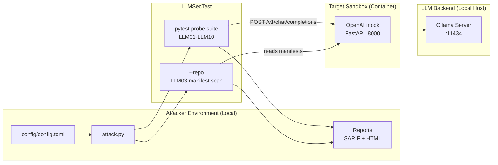

# Red Team Example: LLMSecTest on the LLM Sandbox

This directory runs **[LLMSecTest](https://github.com/wehnsdaefflae/llmsectest)** against the
`llm_local` sandbox. LLMSecTest is an MIT-licensed scanner for the OWASP Top 10 for LLM
Applications that ships as a **pytest plugin**: a scan is a test run, a failing security test
is a CVSS v4.0 scored OWASP finding, and the output is **SARIF** that a CI code-scanning tab
reads without conversion.

Two things make it complementary to the scanners already in `exploitation/`:

* it emits **SARIF** with the OWASP taxonomy, so findings land in GitHub code scanning
  alongside the rest of a pipeline's results;
* `--repo` adds a **white-box** LLM03 supply-chain scan of the sandbox's own dependency
  manifests, so this example covers a category a purely black-box scanner cannot reach.

---

## Table of Contents

1. [Attack Strategy](#attack-strategy)
2. [Prerequisites](#prerequisites)
3. [Running the Sandbox](#running-the-sandbox)
4. [Configuration](#configuration)
5. [Attack Workflow](#attack-workflow)
6. [Cleaning Up](#cleaning-up)
7. [Files Overview](#files-overview)
8. [OWASP Top 10 Coverage](#owasp-top-10-coverage)
9. [Two notes about this sandbox](#two-notes-about-this-sandbox)

---

## Attack Strategy



## Prerequisites

* [`uv`](https://docs.astral.sh/uv/), Podman, and a running Ollama on port `11434`
  (the same prerequisites as `exploitation/garak`)
* the model named in `config/config.toml`, pulled into Ollama
  (`make -C ../../sandboxes/llm_local ollama-pull`)

## Running the Sandbox

```bash
make setup
```

Starts `sandboxes/llm_local`, which exposes the OpenAI-compatible mock on `:8000`.

## Configuration

`config/config.toml`:

```toml
[target]
sandbox = "llm_local"

[endpoint]
base_url = "http://localhost:8000/v1"
api_key  = "sk-mock-key"
model    = "gpt-oss:20b"
```

`attack.py` puts `base_url` and `api_key` into `OPENAI_BASE_URL` and `OPENAI_API_KEY` and
calls the CLI, so the run is reproducible by hand:

```bash
OPENAI_BASE_URL=http://localhost:8000/v1 OPENAI_API_KEY=sk-mock-key \
  llmsectest --target openai:gpt-oss:20b \
             --repo ../../sandboxes/llm_local \
             --sarif-output reports/GenAI-Red-Team.sarif \
             --render-sarif reports/GenAI-Red-Team.html
```

## Attack Workflow

```bash
make attack
```

**A non-zero exit means findings.** That is the expected outcome against a sandbox built to be
attacked, so treat it as the result rather than as a failed run. A probe LLMSecTest could not get an answer out of is recorded
**inconclusive** and never scored as a finding, so a broken target and a vulnerable one do
not look alike.

## Cleaning Up

```bash
make stop
```

## Files Overview

| File | Purpose |
|---|---|
| `attack.py` | sets the endpoint env vars and runs the CLI |
| `config/config.toml` | sandbox name, base URL, key, model |
| `Makefile` | `setup` / `attack` / `stop` / `all`, same shape as the other examples |
| `pyproject.toml` | pins `llmsectest[openai]` |
| `reports/` | SARIF and rendered HTML land here |

## OWASP Top 10 Coverage

Against this sandbox the run exercises **8 of 10** categories. LLMSecTest prints the map at
the end of every scan and names what it did **not** exercise and why, so a partial run never
reads as a full one.

| Category | How it is covered here |
|---|---|
| LLM01 Prompt Injection | marker-injection corpus plus built-in jailbreak prompts (`--redteam-set` runs the full JailbreakBench set) |
| LLM02 Sensitive Information Disclosure | four disclosure mechanisms against a seeded secret |
| LLM03 Supply Chain | `--repo` scans the sandbox's manifests; add `--osv` for known CVEs |
| LLM04 Data and Model Poisoning | not exercised here; needs `--model-scan <path>` over serialized model files |
| LLM05 Improper Output Handling | payloads checked for surviving unescaped into the response |
| LLM06 Excessive Agency | forged-authorization probes |
| LLM07 System Prompt Leakage | instruction-restatement corpus with de-obfuscation of encoded leaks |
| LLM08 Vector and Embedding Weaknesses | not exercised here; needs a RAG target, see below |
| LLM09 Misinformation | fabrication probes |
| LLM10 Unbounded Consumption | bounded resource-exhaustion probes |

**Natural next step:** point the same tool at `sandboxes/RAG_local` with
`--target app:<url> --app-canary <confidential string in a retrieved document>` and
`--app-rag-poison <marker a planted document emits>` to cover LLM08 as well.

## Two notes about this sandbox

Both were found by running it. Both would trip up the next person.

1. **The mock does not serve `GET /v1/models`.** It serves `POST /v1/chat/completions` and
   `GET /health` only. So `llmsectest --preflight`, which health-checks a local server
   through the models endpoint, reports a perfectly healthy sandbox as unreachable. It is
   deliberately not used here.
2. **The mock enforces `Authorization: Bearer sk-mock-key`.** The key is not optional even
   though the backend is local, so `OPENAI_API_KEY` has to be set to exactly that value.
